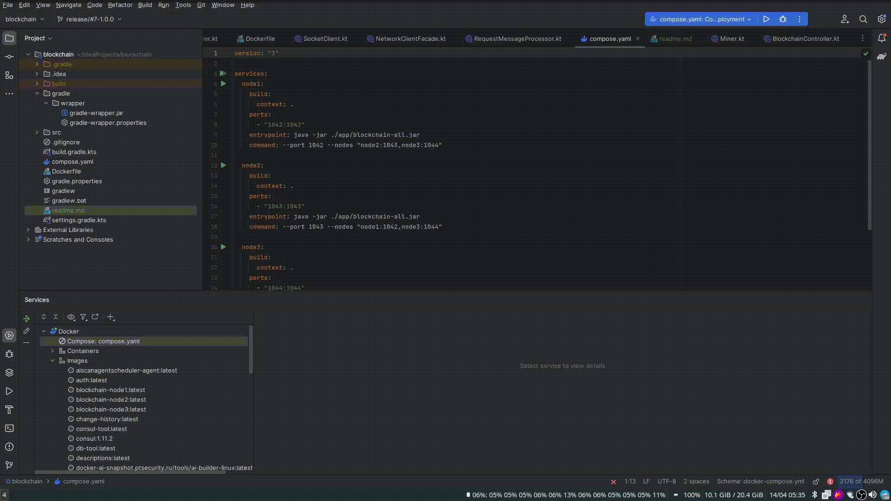

# Simple Blockchain

Простая реализация блокчейна для курса по сетям СПбПУ

### Запуск
Можно использовать docker compose:
```shell
docker-compose up
```

Или ручной запуск из терминала. Для этого необходимо указать следующие аргументы:
```
Options: 
    --port, -p -> server port (always required) { Int }
    --disableMining [false] 
    --nodes -> nodes list (always required) { String }
    --help, -h -> Usage info 
```

### Остановка
```shell
docker-compose down
```

### Демонстрация работы



### Алгоритм работы
Узлы общаются при помощи TCP сокетов из библиотеки ktor-sockets. Для каждого сообщения открывается новое соединение.
При майнинге нового блока узел отправляет всем узлам, про которые она знает, сообщение. При его получении каждый из
узлов проверяет, может ли он добавить его прямо сейчас (является ли индекс узла индексом последнего + 1, будет ли
полученная цепочка валидной и т.д). Если всё в порядке, то он добавляет блок к себе. Иначе, запрашивает у всех узлов
список их хешей (не полностью блоков, это сделано для оптимизации). Из всех полученных цепочек узел выбирает 
наибольшую -- считаем, что так как тут PoW, то чем длиннее цепочка, тем она важнее. Затем, он находит последний блок,
который у локальной и найденной цепочек общий и запрашивает у неё все цепочки после данной. Затем он проверяет, что
полученные блоки всё еще могут быть успешно добавлены к существующим (с возможной заменой некоторых из блоков).

При операциях с добавлением новых блоков процесс майнинга перезапускается чтобы минимизировать количество мусорных
сообщений с намайненным новым блоком, который к тому времени уже может оказаться неактуальным
